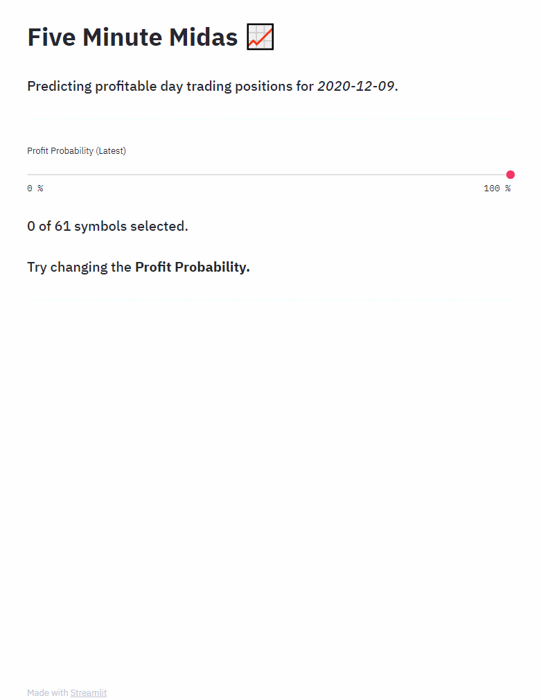
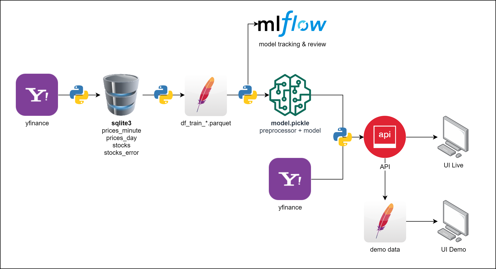

# Five Minute Midas
## Overview
- Predicting profitable day trading positions by fitting a random forest classifier on historical minute-level price data
- Independent end-to-end machine learning project, from data collection to model deployment
- Read the [Medium article](https://michael-ow.medium.com/how-i-used-a-random-forest-classifier-to-day-trade-for-2-months-part-i-9c00d96d254c)!
- Try the [Web App Demo](https://five-minute-midas.herokuapp.com/)!

## Features
- Data collection from Yahoo Finance (SQLite3)
- Data transformation, feature engineering (pandas)
- ML model training, tuning and tracking (scikit-learn, MLflow)
- ML model deployment: API and web app (Flask, Streamlit)

## Data Pipeline

## Installation
- Use **requirements.txt** for the demo.
- Use **requirements_full.txt** for all scripts.

## Methodology
- Minute-level price data is extracted, and filtered to those with [Bullish RSI Divergence](https://www.google.com/search?q=bullish+rsi+divergence)
- These filtered points and their respective profit/loss outcomes are used to train an ML classifier
- With the trained model, we can try to predict future profit/loss outcomes

## Credits
- Price data extracted with the help of the [yfinance](https://github.com/ranaroussi/yfinance) library, created and maintained by [Ran Aroussi](https://github.com/ranaroussi) and other contributors

## Contact
[Michael Ow @ LinkedIn](https://www.linkedin.com/in/michael-ow/)
