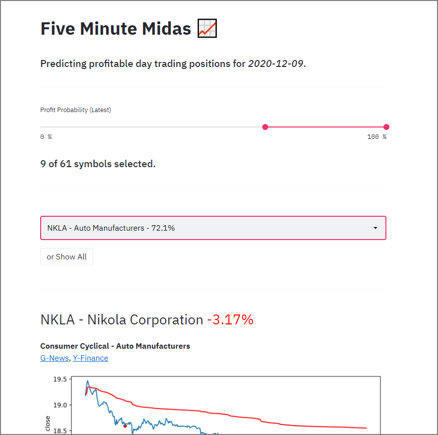

# Five Minute Midas
## Predicting profitable day trading positions.

### Overview
- Minute-level price data is extracted, and filtered to those with [Bullish RSI Divergence](https://www.google.com/search?q=bullish+rsi+divergence)
- These filtered points and their respective profit/loss outcomes are used to train an ML classifier
- With the trained model, we can try to predict future profit/loss outcomes

### Try the [Demo](https://five-minute-midas.herokuapp.com/)

### Notes
- **requirements.txt** is only for the demo.
- **requirements_full.txt** is for all scripts.
